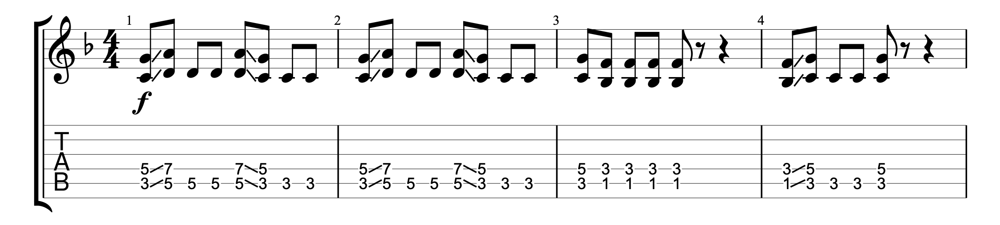
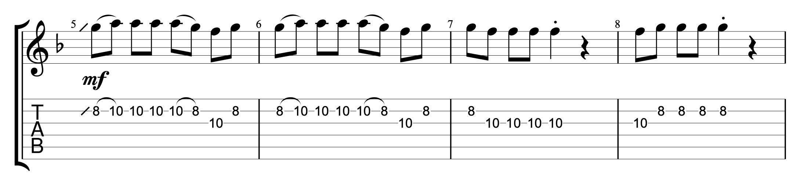
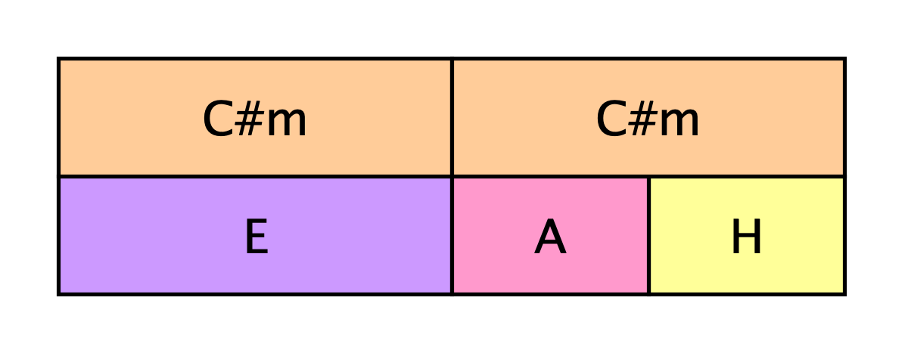

\pagebreak
\pagenumbering{arabic}
## Die Autoren

\pagebreak

## Einleitung
Wann hast du das letzte Mal Brüste gesehen? Und damit meinen wir nicht die Brüste deiner Mutter oder gar deine eigenen!
Merkst du was? Es könnte damit zu tun haben, dass Du deine Gitarre nicht gut genug beherrscht, um bei den Damen zu punkten!

Aber: Rettung ist in Sicht! Wir werden dich in den kommenden 52 Wochen zu dem Schlüpferstürmer schlechthin ausbilden.

\pagebreak

## Voraussetzungen 
Damit Du optimal von diesem Buch profitierst, solltest Du bereits ein wenig Gitarre spielen können.

## Techniken

### Slides

### Bending

### Tapping

### Sweeping

\pagebreak

## Woche 1 - Evil Lynn

Unser erstes Solo stammt aus dem Excess Pressure Titel "Evil Lynn":

### Riff

Die Tonart des Soloteils ist dieses Mal nicht eindeutig bestimmbar, da es sich nur um ein Riff mit drei Powerchords handelt. 
Hier erstmal das Riff:

Die Powerchords sind C5, D5 und H5. Das sind sortiert die Töne C - D - F - G - A - H. 
Je nachdem, ob wir noch ein E oder ein Es hinzufügen, sind wir entweder in F-Dur / D-Moll oder B-Dur / G-Moll unterwegs.
Da im restlichen Song ein E vorkommt, legen wir uns auf D-Moll fest.

### Takte 5 bis 8

Um erstmal gemütlich ins Solo reinzukommen, imitieren wir rhythmisch das Riff und spielen lediglich die Quinten der 
Powerchords eine Oktave höher mit dem zusätzlichen Durchgangston F.

### Takte 9 bis 12

Um die Spannung etwas zu steigern wiederholen wir die letzten Takte, ergänze aber die Sechzehntel-Noten auf der Zählzeit 1.

### Takte 13 bis 16

Jetzt geht es ab: Sweep-Picking mit Achtel-Triolen gefolgt von einem kleinen Lauf in Viertel-Triolen.
Das erste Arpeggio ist ein D-Moll, das Arpeggio in Takt 15 ein B-Dur. In Takt 16 spielen wir statt dem C ein Cis und 
gehe damit in den Modus D harmonisch Moll.

### Takte 17 bis 21

Warum das Rad neu erfinden? Takt 17 und 18 sind die Wiederholung von 13 und 14. So einfach!
Den Abschluss des Solos bildet ein Lauf, bei dem wir die Noten jeweils viermal spielen, das nennt man auch 
Tremolo-Picking. 
Mit dem kleinen Umweg über Cis landen wir dann im Zielton D und fertisch! Viel Spaß beim Üben.

\pagebreak

## Woche 2 - Cream Cheese

### Tonart

Das sind die Akkorde, die wir spielen. Sieht verdächtig nach Cis-Moll als Tonart aus. Jetzt aber zum Solo:

### Takte 1 bis 5

Entspannt starten wir mit einem Cis-Moll-Arpeggio. Mit dem D# komm ein zusätzlicher Ton ins Spiel, die große None. 
Wie ihr sicher wisst, kann man mit einem Auftakt sehr gut die Aufmerksamkeit auf sich lenken, dazu noch leicht die Töne 
synkopiert spielen und schon hat man eine eingängige Melodie.
Im Takt 4 bringen wir dann ein E-Dur-Arpeggio, wieder mit großer None (F#). Den Abschluss der Phrase bildet dann ein 
kleiner Lauf mit dem Zielton C#, der großen None von H. Welch ein Wunder :-)

### Takte 6 bis 9

 

Im zweiten Durchgang wiederholen wir erstmal das Motiv, enden allerdings mit einem A-Dur-Arpeggio, welches sich mit dem 
Dis in der Terz vom H-Dur auflöst. Nice.

### Takte 10 bis 13

 

Im dritten Durchgang spielen wir wieder ein C#-Moll-Arpeggio, allerdings ein paar Lagen höher. Wer es genauer wissen will, 
es handelt sich um die erste Umkehrung des Moll-Dreiklangs. Rhythmisch imitieren wir die Ursprungsphrase, 
damit man die neue Phrase als Weiterentwicklung erkennt.
In Takt 12 folgt dann das E-Dur-Arpeggio in Grundstellung.

### Takte 14 bis 15

 

Hell breaks loose! Im vierten Durchlauf bringen wir krasse Tapping-Action!
In Takt 14 erstmal nur den Cis-Moll-Dreiklang pur, in Takt 15 bewegen wir uns mit der Tapping-Hand nach unten, 
spielen quasi die Melodie.

### Takte 16 bis 18

 

Da mir das so gut gefällt, wiederholen wir das Muster nochmal mit dem E-Dur-Dreiklang, spiele aber ein leicht 
verändertes Melodie-Tapping und lande ganz geschmackssicher in Takt 18 mit dem C# im Grundton von C#-Moll. Voilá!

## Woche 3 - Brand New Start

Gut Ding will Weile haben und jetzt isses mal wieder soweit: Ein Solo der Woche - frisch eingetroffen. 
Wie ihr sicherlich schon wisst, geht's hier immer mit Reinhören los. Also, bitte:

Die Akkorde deuten auf ein ausgeprägtes H-Moll hin.
### Takte 1 bis 4

 

Auftakt ist der Schlüssel zum Glück! Dann folgen ein Haufen Arpeggios, H-Moll, A-Dur, nochmal H (H5) ein D-Dur und
wieder ein H-Moll. Den Ton A# spiele ich, um den Charakter von H harmonisch Moll herauszuarbeiten. 
Ich mache damit F#5 zu einem F#-Dur, da A# die große Terz von F#-Dur ist.

### Takte 5 bis 8

 

Ein gutes Motiv darf man ruhig wiederholen. Der Abschluss ist diesmal jedoch ein H, also die große Terz von G-Dur.

### Takte 9 bis 12

 

Weiter geht es mit einem H-Moll-Arpeggio, bei dem ich in die Quinte F# vom E aus bende. In Takt 10 kommt ein 
F#-Moll-Arpeggio, dass dem E5 noch die Optionen F# (große None), A (Quarte) und C# (große Sexte) hinzufügt und 
im A (Quinte von D) landet.

Takt 11 bietet nochmal ein H-Moll-Arpeggio eine Oktave höher, Takt 12 bringt ein G-Dur-Arpeggio mit Landung im A#.

### Takte 13 bis 16

 

Finale: Läufe aus H-Moll, aber immer die Zieltöne im Auge behalten. In Takt 13 sind das einmal F# (Quinte von H) 
und E (Quinte von A).

In Takt 14 das H (Terz von G) und das F#. Das Arpeggio auf der 3 in Takt 14 soll exotisch klingen, indem es dem F# 
noch die Töne D und D# (kleine und große Sexte), A und A# (kleine und große Terz) sowie das G (kleine None hinzufügt). 
Cool.

Der Abschlusslauf erfordert schon etwas Kondition, also langsam üben. Stilsicher landen wir natürlich im Grundton H. 
Voilà! Viel Spaß beim Üben.

## Woche 4 - Satchurday Evening

## Woche 5 - Creepy Changes

## Woche 6 - On My Way

## Woche 7 - Jamtrack E-Dur

## Woche 8 - Red Carpet Girl

## Woche 9 - Beyond The Veil

## Woche 10 - Dream

## Woche 11 - Into The Darkness

## Woche 12 - Blood Angel

## Woche 13 - Voices In My Head

## Woche 14 - Joe Would Be Proud

## Woche 15 - Crapping On Your Thrown

## Woche 16 - Danish Spring

## Woche 17 - Jamming In C

## Woche 18 - Clown In The Mall

## Woche 19 - Legion

## Woche 20 - Letter Of Stallone

## Woche 21 - My Life

## Woche 22 - Frost Inside Your Lace

## Woche 23 - Hangover

## Woche 24 - Unbreakable

## Woche 25 - Jamtrack Challenge

## Woche 26 - Stormbringer
