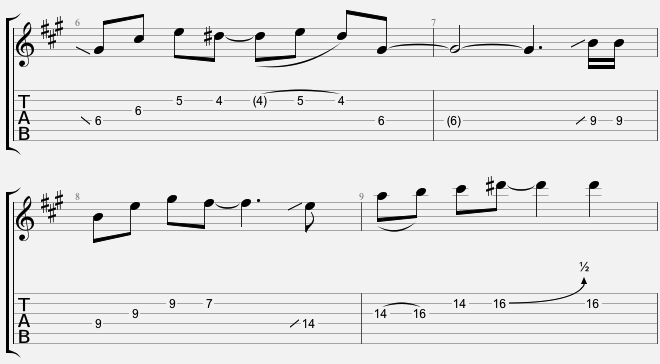
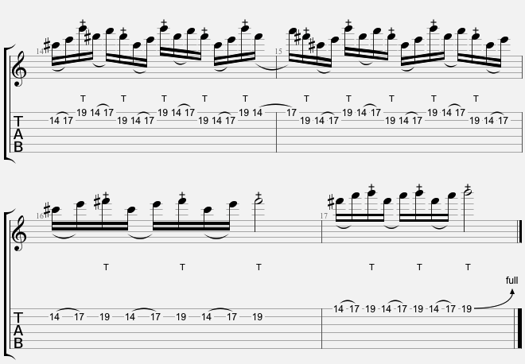

\pagebreak
\pagenumbering{arabic}
## Die Autoren

\pagebreak

## Einleitung
Oh nein, noch ein Gitarrenbuch! Lasst mich in Ruhe, ich muss doch noch die Grifftabelle mit den 1500 wichtigsten 
akkorden auswendig lernen und die Bücher von Peter Bursch habe ich auch noch nicht alle gelesen. Was wollt ihr denn jetzt noch von mir?

Tja, gute Frage, warum haben wir dieses Buch geschrieben und wollen, dass Du es auch liest?

1. Ein Buch gegen das sinnlose Gegniedel von Pentatonik-Skalen
Wir wollen dir zeigen, dass es auch ein Leben nach der A-Moll-Pentatonik am 5. Bund geben kann, 
in dem Du verstehen lernst wann Du welchen Noten speilen solltest

2. Hilfe zur Selbsthilfe
Wir zeigen dir Techniken / Regeln, die dir helfen sollen eigene Soli zu entwickeln

### Was ist dieses Buch nicht?

Wir zeiegen Dir nur von uns selbst geschriebene Sachen, das tausendste "So spielst Du thunderstruck von AC/DC" findest Du hier nicht!

\pagebreak

## Voraussetzungen 
Damit Du optimal von diesem Buch profitierst, solltest Du bereits ein wenig Gitarre spielen können.

## Techniken

Hier als kleiner Refresher die Techniken, die Du bereits beherrschen
### Slides

### Bending

### Tapping

### Sweeping

### Economy Picking

\pagebreak

## Woche 1 - Evil Lynn

Unser erstes Solo stammt aus dem Excess Pressure Titel "Evil Lynn":

### Riff

Die Tonart des Soloteils ist dieses Mal nicht eindeutig bestimmbar, da es sich nur um ein Riff mit drei Powerchords handelt. 
Hier erstmal das Riff:

Die Powerchords sind C5, D5 und H5. Das sind sortiert die Töne C - D - F - G - A - H. 
Je nachdem, ob wir noch ein E oder ein Es hinzufügen, sind wir entweder in F-Dur / D-Moll oder B-Dur / G-Moll unterwegs.
Da im restlichen Song ein E vorkommt, legen wir uns auf D-Moll fest.

### Takte 5 bis 8

Um erstmal gemütlich ins Solo reinzukommen, imitieren wir rhythmisch das Riff und spielen lediglich die Quinten der 
Powerchords eine Oktave höher mit dem zusätzlichen Durchgangston F.

### Takte 9 bis 12

Um die Spannung etwas zu steigern wiederholen wir die letzten Takte, ergänze aber die Sechzehntel-Noten auf der Zählzeit 1.

### Takte 13 bis 16

Jetzt geht es ab: Sweep-Picking mit Achtel-Triolen gefolgt von einem kleinen Lauf in Viertel-Triolen.
Das erste Arpeggio ist ein D-Moll, das Arpeggio in Takt 15 ein B-Dur. In Takt 16 spielen wir statt dem C ein Cis und 
gehe damit in den Modus D harmonisch Moll.

### Takte 17 bis 21

Warum das Rad neu erfinden? Takt 17 und 18 sind die Wiederholung von 13 und 14. So einfach!
Den Abschluss des Solos bildet ein Lauf, bei dem wir die Noten jeweils viermal spielen, das nennt man auch 
Tremolo-Picking. 
Mit dem kleinen Umweg über Cis landen wir dann im Zielton D und fertisch! Viel Spaß beim Üben.

\pagebreak

## Woche 2 - Evil Lynn Harmonisierung

\pagebreak

## Woche 3 - Cream Cheese

### Tonart

Das sind die Akkorde, die wir spielen. Sieht verdächtig nach Cis-Moll als Tonart aus. Jetzt aber zum Solo:

### Takte 1 bis 5

Entspannt starten wir mit einem Cis-Moll-Arpeggio. Mit dem D# komm ein zusätzlicher Ton ins Spiel, die große None. 
Wie ihr sicher wisst, kann man mit einem Auftakt sehr gut die Aufmerksamkeit auf sich lenken, dazu noch leicht die Töne 
synkopiert spielen und schon hat man eine eingängige Melodie.
Im Takt 4 bringen wir dann ein E-Dur-Arpeggio, wieder mit großer None (F#). Den Abschluss der Phrase bildet dann ein 
kleiner Lauf mit dem Zielton C#, der großen None von H. Welch ein Wunder :-)

### Takte 6 bis 9

 

Im zweiten Durchgang wiederholen wir erstmal das Motiv, enden allerdings mit einem A-Dur-Arpeggio, welches sich mit dem 
Dis in der Terz vom H-Dur auflöst. Nice.

### Takte 10 bis 13

 

Im dritten Durchgang spielen wir wieder ein C#-Moll-Arpeggio, allerdings ein paar Lagen höher. Wer es genauer wissen will, 
es handelt sich um die erste Umkehrung des Moll-Dreiklangs. Rhythmisch imitieren wir die Ursprungsphrase, 
damit man die neue Phrase als Weiterentwicklung erkennt.
In Takt 12 folgt dann das E-Dur-Arpeggio in Grundstellung.

### Takte 14 bis 15

 

Hell breaks loose! Im vierten Durchlauf bringen wir krasse Tapping-Action!
In Takt 14 erstmal nur den Cis-Moll-Dreiklang pur, in Takt 15 bewegen wir uns mit der Tapping-Hand nach unten, 
spielen quasi die Melodie.

### Takte 16 bis 18

 

Da mir das so gut gefällt, wiederholen wir das Muster nochmal mit dem E-Dur-Dreiklang, spiele aber ein leicht 
verändertes Melodie-Tapping und lande ganz geschmackssicher in Takt 18 mit dem C# im Grundton von C#-Moll. Voilá!

\pagebreak

## Woche 4 - Brand New Start

 

Gut Ding will Weile haben und jetzt isses mal wieder soweit: Ein Solo der Woche - frisch eingetroffen. 
Wie ihr sicherlich schon wisst, geht's hier immer mit Reinhören los. Also, bitte:

Die Akkorde deuten auf ein ausgeprägtes H-Moll hin.

### Takte 1 bis 4

 

Auftakt ist der Schlüssel zum Glück! Dann folgen ein Haufen Arpeggios, H-Moll, A-Dur, nochmal H (H5) ein D-Dur und
wieder ein H-Moll. Den Ton A# spiele ich, um den Charakter von H harmonisch Moll herauszuarbeiten. 
Ich mache damit F#5 zu einem F#-Dur, da A# die große Terz von F#-Dur ist.

### Takte 5 bis 8

 

Ein gutes Motiv darf man ruhig wiederholen. Der Abschluss ist diesmal jedoch ein H, also die große Terz von G-Dur.

### Takte 9 bis 12

 

Weiter geht es mit einem H-Moll-Arpeggio, bei dem ich in die Quinte F# vom E aus bende. In Takt 10 kommt ein 
F#-Moll-Arpeggio, dass dem E5 noch die Optionen F# (große None), A (Quarte) und C# (große Sexte) hinzufügt und 
im A (Quinte von D) landet.

Takt 11 bietet nochmal ein H-Moll-Arpeggio eine Oktave höher, Takt 12 bringt ein G-Dur-Arpeggio mit Landung im A#.

### Takte 13 bis 16

 

Finale: Läufe aus H-Moll, aber immer die Zieltöne im Auge behalten. In Takt 13 sind das einmal F# (Quinte von H) 
und E (Quinte von A).

In Takt 14 das H (Terz von G) und das F#. Das Arpeggio auf der 3 in Takt 14 soll exotisch klingen, indem es dem F# 
noch die Töne D und D# (kleine und große Sexte), A und A# (kleine und große Terz) sowie das G (kleine None hinzufügt). 
Cool.

Der Abschlusslauf erfordert schon etwas Kondition, also langsam üben. Stilsicher landen wir natürlich im Grundton H. 
Voilà! Viel Spaß beim Üben.

\pagebreak

## Woche 5 - Satchurday Evening

Das folgende Solo ist von Joe "Satch" Satriani inspiriert. Wenn ihr Satriani ein bißchen kennt, wisst ihr, dass er äußerst 
singbare Melodien erfindet und seine Haupttechnik das Legato-Spiel ist.

Die Rhythmusgitarre spielt folgende Akkorde:

 

Hm, welche Tonart könnte das sein? Wenn wir nur die ersten sechs Akkorde anschauen, haben wir ein ausgeprägtes H-Dur.

Mit dem G#-Dur und dem D#-Dur verlassen wir kurz mal H-Dur. Da aber nur zwei Töne, nämlich die Terzen, anders 
sind als bei G#-Moll und D#-Moll, macht das erstmal nix. Die Akkordfolge wird insgesamt 3 mal gespielt, 
ich habe also drei Runden Zeit mich auszutoben.

### Takte 1 bis 5

 

Erstmal vorweg: Die Taktart ist nicht wie bisher 4/4 sondern 12/8. Das nennt man auch Rockballade. 
Ihr könnt euch das aber auch wie einen normalen 4/4 vorstellen, nur dass die Achtel jetzt alle triolisch gespielt werden. 
Klaro?

Dann: Ohne Motiv geht nix! Nach einem Auftakt (ihr wisst, dass ich nicht ohne kann) spiele ich ein Motiv mit den 
Zieltönen H (12. Bund h-Saite) und F# (11. Bund g-Saite). Läuft.

Jetzt schaue ich, dass ich geschmeidig ins G#-Moll komme, dafür nehme ich die Quinte D# auf der 1 ins Takt 3; 
auch aufm E-Dur passt die Quinte H gut.

Ja, und weil mir das so gut gefällt, auch die Quinte C# von F#-Dur in Takt 4, dazu noch ein bisschen Quarte (H) und 
große Terz A#. Quinte G# für C#-Moll. Fasst schon langweilig von den Tönen her, aber der Rhythmus und die Phrasierung 
machen den Unterschied, alles leicht synkopiert, ihr wisst schon.

### Takte 6 bis 9

 

In der zweiten Runde musste ich jetzt mal was losmachen. Ich wiederhole mein Motiv, ziehe aber rhythmisch etwas an. 
Z.B. spiele ich nicht nur das F# auf Zählzeit drei in Takt 6, sondern ein volles Arpeggio in Grundstellung, 
schön reingesweept, einmal rauf und wieder runter.

Mit dem D# verfahre ich genauso, schön legato von oben rein. Hier seht ihr auch schon, dass man Rhythmus manchmal 
einfach nachfühlen muss. Ich war ganz schön erstaunt, als ich beim Notieren gesehen habe, dass ich da ne Septole 
runtergezockt habe. Fett! Der Rest vom Takt unspektakulär.

Dann mit ein ein paar fluffigen Bendings und Doublestops das Motiv im achten Takt garniert. 
Im neunten Takt packe ich dann nochmal das Tremolopicking aus.

### Takte 10 bis 14

 

Ok, jetzt Endspurt, Zielgerade, nochmal alles geben! Motiv diesmal eine Quinte höher wiederholt, darum landen wir 
jetzt auch auf dem Grundton C# mit einem cremigen Tremolo-HammerOn-PullOff-Dingsbums. 
Auch hier wieder absolut funky, dass zu notieren...

Dann Terz H von G#-Moll und Terz G# von E-Dur.

Puh, der Lauf in Takt 12 ist mal total gegen den Grundrhythmus des 12/8-Taktes, da ich aber wieder sicher im C# lande, 
kein Problem. Go crazy - sometimes!

Bendings tun immer gut, müssen aber exakt ausgeführt werden, by the way. Im letzten Takt bende ich schön in die 
Quinte D# von G#-Dur, dann zum Abschluss noch ein schönes D#-Dur-Arpeggio mit geschmackvoller Landung im D#, 
das quasi schon die Quinte vom drauf folgendem H-Dur vorwegnimmt.

\pagebreak

## Woche 6 - Creepy Changes

Die Rhythmusgitarre spielt folgende Akkorde:

 

Man sieht hier gut, warum das Teil Creepy changes heißt, weil hier von einem Akkord sowohl der Dur als auch 
der Moll-Dreiklang erklingt. Das ist in einem diatonsichem Umfeld normalerweise nicht zulässig.

### Takte 1 bis 5

 

Auftaktig geht es los, das sollte mittlerweile ein alter Hut sein, aber funktioniert immer. Mein Motiv ist synkopiert, 
um es interesanter zu machen, da ich ja im ersten Takt lediglich die Akkordtöne von Fis-dur (F#, A# und C#) spiele.

Im zweiten Takt umspiele ich das C# (Grundton von C#-Dur) mit der großen None D#, halte aber den Ball eher flach.

In Takt 3 müssen wir etwas aufpassen, da jetzt der Basisakkord C#-Moll ist und wir deshalb vom D# nur einen 
Halbton bis zum E benden (Terz von C#-Moll). Stilsicher landen wir auf dem Grundton von H-Dur.

### Takte 6 bis 9

 

Unser Motiv ist noch nicht fertig, der zweite Teil ist relativ simpel: Wir umspielen noch etwas den Grundton von H-Moll, 
gehen dann auf A# (Terz von F#-Dur) und dann auf das G#. Das D# ist die Quinte G#-Dur und mit einem lässigen 
Bending geht es wieder ins G#, um quasi die Quinte von C#-Dur vorwegzunehmen.

### Takte 10 bis 11

 

Wie wir schon öfter gesehen haben, ist es sinnvoll, das Motiv beim zweiten Durchgang eine Oktave höher zu wiederholen. 
In Takt 11 haben wir dann einen schönen Triller, den ich recht frei improvisiert habe, deshalb die komische Notation 
mit 11 "Sechzehntel" über 2 Viertel, fühlte sich einfach passend an.

### Takte 12 bis 13

 

Das Motiv aus Takt 4 wiederholt, allerdings den Abschluss gleich mal ne Oktave höher, 
um noch etwas mehr Spannung reinzubringen.

### Takte 14 bis 17

 

Finale, oh ho! H-Moll umspielt mit H, C# und F# (Grundton, None, Quinte), F#-Dur mit Terz (A#), Quarte (H) und 
Grundton und dann mit G# und D# den G#-Dur angedeutet.

Den Abschluß bildet dann ein gestaffeltes Bending von E# (große Sexte), über die kleine Septime (F#) zum G#. 
Ihr bendet erst mal einen Halbton und dann darauf noch einen Ganzton. Bam!

\pagebreak

## Woche 7 - On My Way

Die Rhythmus-Gitarre spielt folgende Akkorde:

 

Die Tonart ist E-Moll. Auf zum Atom!

### Takte 1 bis 4

 

Was passiert hier? Wir spielen zu den einzelnen Akkorden das passende Arpeggio: über E5 spielen wir ein E-Moll-Arpeggio, 
über C5 ein C-Dur-Arpeggio, D-Dur über D5 und H-Dur über H5. Da wir H-Dur bringen, kommt das D# dazu, 
was eigentlich nicht in E-Moll ist. Dadurch entsteht - wer ahnt es? - E harmonisch Moll. Nice!

Die Technik, die wir einsetzen heißt Sweep-Picking, dazu demnächst mal einen ausführlichen Artikel. 
Wir spielen Gruppen von 6 Noten was mit normalen Sechzehntelnoten gespielt, eine schöne Akzentverschiebung gibt. 
Stichwort: Accent Shifting!

### Takte 5 bis 8

 

Da Musiker immer faul sind, wiederhole auch ich einfach die Arpeggios aus Takt 1 und 2. In Takt 3 bringe ich dann ein 
G-Dur-Arpeggio. Den Abschluss bildet wieder ein Arpeggio in H-Dur, allerdings lande ich diesmal auf der Quinte F#. 
Schon sind wir fertig und können uns wieder an die Sonne raus hocken!

\pagebreak

## Woche 8 - Jamtrack E-Dur

Herzlisch Willkommen zu einer neuen Ausgabe von "Solo der Woche". Ich habe da schonmal etwas vorbereitet:
Wie der Titel schon sagt, handelt es sich um die Tonart E-Dur; die Rhythmus-Gitarre spielt folgende Akkorde:

 

### Takte 1 bis 6

 

"Auftakt" ist mein zweiter Vorname! Wenn ihr schon beginnt, wenn noch keiner spielt, habt ihr alles richtig gemacht in 
punkto "Aufmerksamkeit auf euch ziehen"!

Los geht es mit einem kleinen Open-String-Lick mit den Tönen E und H (Grundton und Quinte von E-Dur), 
dann wieder eine String-Skipping-Idee mit Abschluss im C#, der vorgezogene Grundton des nächsten Akkords.

In Takt 5 und 6 spielen wir den Akkord C#-Moll auch komplett aus: Terz E am 9. Bund auf der G-Saite, dann Quinte G#, 
nochmal Terz und zum Schluss den Grundton C#. Wie ihr sicher seht, alles gegen den Takt, also synkopiert.

### Takte 7 bis 10

 

Auf was man beim jammen nicht alles kommt: Ein C#-Moll-Arpeggio über G#-Moll. Warum funktioniert das?

Ganz einfach: C#-Moll besteht aus C# - E - G#. C# ist die Quarte von G#, G# ist der Grundton und das E lösen wir 
auch recht schnell in D# (Quinte von G#-Moll) auf. Der Sound der dabei entsteht hat was Interessante, 
ihr hört eigentlich einen G#-Moll 6  / 11 Akkord.

### Takte 11 bis 13

 

Im Westen nix Neues: wir wiederholen einfach unser Lick aus Takt 2 und 3, allerdings wiederholen wir das 
String-Skipping-Ding eine Oktave höher.

### Takte 14 bis 19

 

Jetzt fliegt die Kuh: wir spielen ein Legato-Lick mit 32teln! Ein bißchen von Satriani inspiriert. 
Dann spielen wir G#-Moll aus: vorgezogener Grundton, dann Quinte, dann Bending auf Grundton, Terz auf der E-Saite. 
Release-Bend und Quinte. BAM!

Diese Idee nutzen wir gleich aus, um auch die Akkorde A und H auszuspielen: Bend und Release, dann Terz und Grundton 
von A. Bend und Release, dann Grundton von H und Oktave. Da ich mein Anfangslick so cool finde, 
schließe ich damit auch das ganze Stück nochmal ab.

Viel Spaß beim Üben!

\pagebreak

## Woche 9 - Red Carpet Girl

Die Begleitung besteht durchgängig aus abgewandelten Powerchords:

 

Ich spiele erst den normalen Powerchord A5, dann A mit kleiner Sexte und schließlich A mit großer Sexte.

### Takte 1 und 2

 

Im Gegensatz zu den letzten Soli fangen wir nicht gemütlich an, sondern steigen gleich mit ner krassen Tapping-Action ein. 
Triolen mit den Tönen der A-Moll-Tonleiter.

### Takte 3 und 4

 

Weiter geht es mit Tapping, doch wir steigern das Tempo indem wir statt Achtel-Triolen nun Sechzehntel spielen. 
Interessant ist, dass wir in Takt 3 das F# dabeihaben.

Wie passt das denn zu A-Moll?

Ganz easy, Wir hatten ja schon Natürlich Moll (A H C D E F G) und Harmonisch Moll (A H C D E F G#). 
Wenn wir das F zum F# machen, bekommen wir die Melodisch-Moll-Tonleiter 
In Takt 4 gehen wir dann wieder zum Natürlich Moll zurück, da hier im Begleitakkord auch wieder das F erklingt.

### Takte 5 und 6

Ich wiederhole einfach die Takte 1 und 2. That's all :-)

### Takte 7 und 8

 

Kommen wir nun zum Abschluss. Ein kleiner Lauf über C und D. Hier benutze ich Arpeggios in C-Dur und D-Dur. 
Um genauer zu sein, ist das C-Dur Arpeggio ein Cmaj7-Arpeggio (C E G H)

Ihr seht, es ist also extrem wichtig, dass ihr darauf achtet, was die Rhythmus-Fraktion an Akkorden so anbietet!

\pagebreak

## Woche 10 - Red Carpet Girl

Auch bei diesem Solo gibt es eine zweite Lead-Stimme.

### Takte 1 und 2

 

Die erste Triole bzw. die getappten Töne sind in Quarten (D-G, E-A, A-D) harmonisiert, danach folgen diatonische Terzen (C-E, H-D, A-C)

### Takte 3 und 4

 

Auch hier geht es mit Terzen weiter, wobei wir darauf achten müssen, dass wir in Takt 3 A Dorisch (A-H-C-D-E-F#-G) 
und in Takt 4 A natürlich Moll (A-H-C-D-E-F-G) haben

### Takte 7 und 8

 

Das Abschluss-Arpeggio der zweiten Stimme ist in diesem Fall auch eine Terz höher und ist 
folglich ein Em7-Arpeggio (E-G-H-D).

\pagebreak

## Woche 11 - Beyond The Veil

Die Akkorde sind ausschließlich Powerchords. Grundton und Quinte. Die nehmen wir mal auseinander:

 

#TODO Tabelle

Zwei Vorzeichen deuten auf D-Dur bzw. H-Moll hin.

### Takte 1 bis 5

 

Auftaktig geht es in die erste Runde. Wie ihr unlängst wisst, erzeugt ihr mit einem Auftakt immer mehr Aufmerksamkeit, 
als wenn ihr erst auf der 1 des ersten Taktes anfangt. Word! Unser erstes Motiv besteht hauptsächlich aus Triolen. 
Vierteltriolen sind prima, um auch bei hohem Tempo entspannt zu solieren und trotzdem ein interessantes Motiv zu bekommen.

### Takte 6 bis 7

 

Jetzt fliegt die Kuh! Dieses kleine Tappinglick besteht aus 6 Noten und wird 5 mal wiederholt. 
Dadurch entsteht eine coole Akzentverschiebung.

### Takte 8 bis 9

 

Mit Accent Shifting geht es hier auch gleich weiter. Bei Zählzeit 3 in Takt 9 wartet ein Schmankerl auf uns. 
Ein getapptes Bending. wie funktioniert das? Ihr tappt am 22. Bund und zieht dann sowohl mit dem Tappingfinger 
als auch mit der Greifhand die Saite.

### Takte 10 bis 13

 

Wir wiederholen das Motiv vom Anfang, jedoch eine Oktave höher. 
In Takt 12 bringen noch ein Bending unter und spielen die Triole abwärts staccato, um etwas Abwechslung reinzubringen.

### Takte 14 bis 17

 

Auch die Tapping-Idee wird wiederholt, allerdings ist der Abschluss etwas vereinfacht, 
weil das Griffbrett leider schon zu Ende ist. Auch hier zum Schluss ein getapptes Bending.

\pagebreak

## Woche 11 - Beyond The Veil Harmonisierung

Auch für dieses Stück gibt es eine zweite Stimme im Solo. Here we go!

### Takte 1 bis 5

 

Da sich die erste Stimme in der Tonhöhe ganz beträchtlich nach oben schraubt, packe ich mal besser ne Terz drunter. Passt.

### Takte 6 bis 9

 

Beim Tapping-Teil war ich mir nicht so sicher, dass ne Terz passt, bzw. wollte ich das coole Tapping-Muster beibehalten 
und bleibe deshalb eine Quinte unter der ersten Stimme.

### Takte 10 bis 13

 

Terzen sind hier wieder die sichere Bank. Die zweite Stimme folgt der ersten eins zu eins.

### Takte 14 bis 17

 

So, Quinte hatten wir schon. Was eignet sich noch zur eleganten Harmonisierung? 
Jup, genau Quarten gehen auch! Hört mal in die alten Scorpions-Klassiker rein.

\pagebreak

## Woche 12 - Dream

Solo der Woche ist diesmal das neue Solo eines überarbeiteten Excess Pressure Songs namens "Dream". 
Ok, was passiert hier? Die Akkorde der Begleitung sind eigentlich recht trivial:

 

Drei Akkorde und gut. So muss das sein.
Kommen wir zum Solo über diese Akkorde.

### Takte 1 bis 4

 

Ich fange ganz gemütlich mit Quinte (F#) und Grundton von Hm an und lasse erstmal klingen. 
Das kann man auch ruhig guten Gewissens machen, wenn der Ton zum Akkord passt wie in diesem Fall. 
Dann geht es gemütlich weiter. Ich spiele ein G und ziehe es zum A hoch.
A ist die große None zu G-Dur und zugleich schon die Terz vom nächsten Akkord F#m. Ich deute also schonmal an, 
wohin die Reise geht. Spätestens mit dem C# (Quinte von F#m) auf Zählzeit 4 bin ich in F#m angekommen. Läuft!

### Takte 5 bis 8

 

Mehr Dynamik bitte. Wie's geht?
In Takt 5 geht's nach oben (E-Saite 14. Bund), in Takt 7 bringe ich Achtelnoten, also rhythmisch dichter. Interessant ist, dass in Takt 7 ein D-Dur  über G-Dur erklingt.

Warum funktioniert das?

D-Dur besteht aus D-F#-A. D ist die Quinte von G und A die große None, wie oben erwähnt. 
Das F# ist die große Septime zu G-Dur, klingt eigentlich nicht so prall. Ist in diesem Fall aber nicht so schlimm, 
da F# auf der Zählzeit 1+ kommt und damit eine  Durchgangsnote ist.

### Takte 9 bis 12

 

Howdy! Wir ziehen die Schlinge enger: Mehr Achtel, String Skipping, Double Stops und Synkope. 
Alles was ein Gitarren-Cowboy drauf haben sollte.

### Takte 13 bis 16

 

Rhythmisch noch dichter, indem wir die Triolen auspacken. Als Tonmaterial dient uns jetzt die H-Moll-Tonleiter. 
Aber es gibt doch mehrere Molltonleitern, welche genau meinst du? Richtig, man unterscheidet zwischen: 
Natürlich, harmonisch und melodisch Moll. Welche nehme ich jetzt? Kann mich nicht entscheiden, 
ich schwanke zwischen natürlich und harmonisch. Die unterscheiden sich auch nur in einem Ton nämlich dem A bzw A#.
Am Anfang des Triolenlaufs nehme ich A# (harmonisch Moll) um dann erstmal in Takt 14 wieder das A zu nehmen. 
In Takt 15 nehme ich dann für den Double Stop wieder das A#.

### Takte 17 bis 20

 

Hell bend for leather! Bendings bis der Arzt kommt.

### Takte 21 und 22

 

Ein schönes Open String Lick bereitet uns auf das Finale vor.

### Takte 23 bis 24

 

Jetzt nur noch ein winziges Läufchen und ein geschmackvolles Bending auf unseren Zielton C#. Voilà!

\pagebreak

## Woche 12 - Dream Harmonisierung

Für die Albumversion des Songs habe ich noch eine zweite Stimme in den Takten 13 bis 16 eingespielt. 
Die will ich euch natürlich nicht vorenthalten:

 

Einfach das Originalmotiv eine Terz höher gespielt. That's it!

### Todo
Tremolopicking part

\pagebreak

## Woche 13 - Into The Darkness

### Takt 1

 

Nicht lang snacken, Kopp inn Nacken! Der erste Takt hat es schon in sich: Melodie-Tapping Deluxe. 
Deshalb hier mal im einzelnen: Wir nehmen ein stinknormales E-Moll-Arpeggio (grün) in Grundstellung und tappen darüber die Melodie (rot).

 

Falls euch das jetzt zu schnell geht, hier nochmal die Melodie einzeln:

 

Eine Besonderheit gibt es noch. Die letzte Note im Takt ist ein Fis anstatt von G. Das hat mechanische Gründe. 
Das nächste Arpeggio in Takt 2 ist ein C-Dur-Arpeggio bei dem der 15. Bund getappt wird, deshalb muss ich da Platz machen.

### Takte 2 bis 4

 

Was soll ich groß sagen? Ich ziehe in Takt zwei und drei den gleichen Stiefel durch. 
Die Arpeggios sind C-Dur und H-Moll. In Takt vier beende ich die Phrase mit einem entspannten Viertel-Triolen-Lauf.

### Takte 5 bis 8

 

So ein cooles Thema muss ich einfach wiederholen. Deshalb auch nix neues in Takt 5 bis 7. 
Der Triolenlauf in Takt 8 hat ein paar andere Töne, but that's it.

### Takte 9 bis 12

 

Jetzt wird es wieder etwas spannender. Die folgenden Takte könnte man als "call and response" zusammenfassen. 
In Takt 9 rufe ich (call) und antworte in Takt 10 eine Oktave höher (response) mit einem ähnlichen Motiv. 
Das wiederhole ich in Takt 11 und schließe mit einer leicht veränderten Phrase in Takt 12 ab.

### Takte 13 bis 16

 

Der letzte Teil ist jetzt nix für Introvertierte: hier müsst ihr mal aus euch rausgehen, wie Attila Dorn von Powerwolf agen würde. 
Ein kleiner Shredding Part in E-Moll. Das Interessante daran ist, dass wir den Lauf durch Gruppierungen von 
jeweils 6 Noten etwas auflockern. Das führt zu Akzentverschiebungen und ist gut gegen die Tonleiter-Langeweile.
Da unser Grundtempo mit knapp 160 BPM schon recht sportlich ist, brauchen wir für diesen Part eine solide Pickingtechnik. 
Ich habe hier versucht mit Economy Picking zu arbeiten. Economy Picking ist eine Mischung aus Alternate und Sweep Picking. 
Ihr pickt erstmal Alternate, behaltet aber bei einem Saitenwechsel die Anschlagsrichtung bei, wenn die Richtung des 
Saitenwechsels gleich der Pickingrichtung vor dem Wechsel ist. Hier mal der direkte Vergleich:

Hier nochmal mit mit den Anschlagsrichtungen:

 

Viel Spaß beim Zocken!

\pagebreak

## Woche 14 - Blood Angel

### Tonart-Analyse

Die Akkorde sind Em, D und C. Also haben wir es mit der Tonart G-Dur bzw. E-Moll zu tun.

### Takte 1 bis 4

 

Bauen wir uns als erstes ein Motiv. 
Unser Motiv fängt auf der 3 des ersten Taktes an und geht bis zur 2 des nächsten Taktes (Grüner Kreis). 
Rhythmisch interessant wird unser Motiv durch die Synkopen.

 

Das Motiv wird viermal wiederholt, wobei ich beim zweiten Mal lediglich die letzten zwei Schläge ändere. 
Beim dritten Mal gehe ich eine Saite nach oben, beim vierten Mal außerdem hoch zum 17. Bund.
Spannung steigern wir also durch das Verschieben des Motivs über das Griffbrett.

### Takte 5 bis 8

 

Noch mehr Spannung können wir aufbauen, wenn wir rhythmisch dichter spielen. Deshalb bringe ich in Takt 5 auch die Sechzehntel-Triolen.
In Takt 6 spiele ich wieder das Originalmotiv aus Takt 1, allerdings jetzt auf der G- und der D-Saite. Dadurch verändert sich der Sound, da die tieferen Saiten etwas dumpfer klingen, und auch die Pinch Harmonics einen anderen Charakter haben.

 

In Takt 7 erzeuge ich noch mit einer kleinen String-Skipping-Idee etwas Aufmerksamkeit, 
bevor es mit entspannten Achteltriolen in den Zielton E geht (Bending vom 22. Bund aus).

\pagebreak

## Woche 15 - Blood Angel Harmonisierung

 

 
 
 

\pagebreak

## Woche 16 - Voices In My Head

\pagebreak

## Woche 17 - Joe Would Be Proud

\pagebreak

## Woche 18 - Crapping On Your Thrown

\pagebreak

## Woche 19 - Danish Spring

\pagebreak

## Woche 20 - Jamming In C

\pagebreak

## Woche 21 - Clown In The Mall

\pagebreak

## Woche 22 - Legion

\pagebreak

## Woche 23 - Letter Of Stallone

\pagebreak

## Woche 24 - My Life Erstes Solo

\pagebreak

## Woche 25 - My Life Zweites Solo

\pagebreak

## Woche 26 - Frost Inside Your Lace

\pagebreak

## Woche 27 - Hangover

\pagebreak

## Woche 28 - Unbreakable Erstes Solo

\pagebreak

## Woche 29 - Unbreakable Erstes Solo

\pagebreak

## Woche 30 - Jamtrack Challenge

\pagebreak

## Woche 31 - Stormbringer

\pagebreak

## Woche 32 - Stormbringer Harmonisierung

\pagebreak

## Woche 33 - Hands of Destruction
